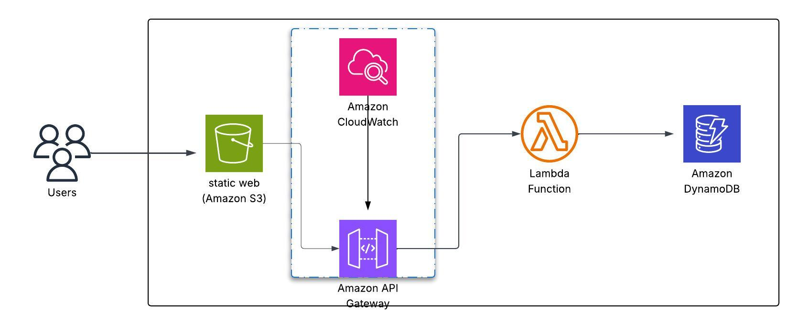

# 📦 Serverless REST API Project using AWS Lambda and DynamoDB

## 🧠 Project Overview

This project demonstrates a simple **To-Do List** application built using a **serverless architecture** on AWS.  
The goal is to develop a REST API that supports basic CRUD operations (Create, Read, Update, Delete) without managing any servers.

---

## 🧱 Infrastructure Components

- **Amazon API Gateway**: Exposes REST endpoints for the application.
- **AWS Lambda**: Executes business logic and handles incoming requests.
- **Amazon DynamoDB**: NoSQL database used to store task data.
- **AWS IAM**: Controls permissions and access between services.
- **Amazon CloudWatch**: Monitors and logs system activities.
- **Amazon S3**: Hosts the front-end of the application.

---

## 🖼️ Architecture Diagram

---

## 🔁 Data Flow: From User to Database

Here is a step-by-step explanation of the request journey from the user to the database:

1. **User interacts with the front-end**  
   - The user accesses the front-end hosted on **Amazon S3** and performs actions (e.g., clicking "Add Task").

2. **Sending request to the REST API**  
   - The browser sends an HTTP request (`POST`, `GET`, `PUT`, or `DELETE`) to **Amazon API Gateway**,  
     including necessary data like task name or ID.

3. **API Gateway forwards request to Lambda**  
   - Based on the HTTP method, **API Gateway** routes the request to the appropriate **AWS Lambda function**.

4. **Lambda processes the data**  
   - The Lambda function handles the request logic (e.g., create, update, retrieve tasks)  
     and uses the AWS SDK to interact with **DynamoDB**.

5. **Interacting with DynamoDB**  
   - Lambda sends a request to **DynamoDB** to perform the required operation on the database.

6. **Response to user**  
   - Once the database operation is complete, Lambda sends a response back to **API Gateway**,  
     which in turn responds to the user's browser.

7. **Monitoring and logging**  
   - Throughout the process, **Amazon CloudWatch** logs events and metrics for monitoring performance and troubleshooting.

---

🎯 This serverless setup provides an efficient, scalable, and cost-effective way to build web APIs without managing infrastructure.

